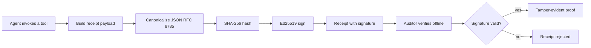
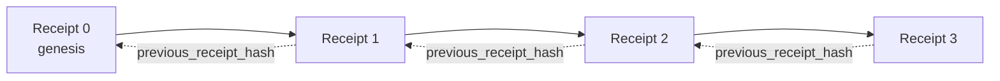

[Watch the lesson video: Securing AI Agents with Cryptographic Receipts](https://youtu.be/PLACEHOLDER_VIDEO_ID)

> _(Lesson video and thumbnail to be added by the Microsoft content team post-merge, matching the lesson 14 / 15 pattern.)_

# Securing AI Agents with Cryptographic Receipts

## Introduction

This lesson will cover:

- Why audit trails for AI agents matter for compliance, debugging, and trust.
- What a cryptographic receipt is and how it differs from an unsigned log line.
- How to produce a signed receipt for an agent's tool call in plain Python.
- How to verify a receipt offline and detect tampering.
- How to chain receipts so that removing or reordering one breaks the chain.
- What receipts prove and what they explicitly do not prove.

## Learning Goals

After completing this lesson, you will know how to:

- Identify the failure modes that motivate cryptographic provenance for agent actions.
- Produce an Ed25519-signed receipt over a canonical JSON payload.
- Verify a receipt independently using only the signer's public key.
- Detect tampering by re-running verification on a modified receipt.
- Build a hash-chained sequence of receipts and explain why the chain matters.
- Recognize the boundary between what receipts prove (attribution, integrity, ordering) and what they do not (correctness of the action, soundness of the policy).

## The Problem: Your Agent's Audit Trail

Imagine you have deployed an AI agent for Contoso Travel. The agent reads customer requests, calls a flights API to look up options, and books seats on the customer's behalf. Last quarter, the agent processed 50,000 bookings.

Today an auditor arrives. They ask a simple question: "Show me what your agent did."

You hand over your log files. The auditor looks at them and asks the harder question: "How do I know these logs were not edited?"

This is the audit-trail problem. Most agent deployments today rely on:

- **Application logs**: written by the agent itself, editable by anyone with file-system access.
- **Cloud logging services**: tamper-evident at the platform level but only if the auditor trusts the platform operator.
- **Database transaction logs**: well-suited for database changes but not for arbitrary tool calls.

None of these can answer the auditor's question without requiring the auditor to trust someone (you, your cloud provider, your database vendor). For internal use, that trust is often acceptable. For regulated workloads (finance, healthcare, anything subject to the EU AI Act), it is not.

Cryptographic receipts solve this by making each agent action independently verifiable. The auditor does not need to trust you. They need only your public key and the receipt itself.

## What is a Cryptographic Receipt?

A receipt is a JSON object that records what an agent did, signed with a digital signature.



A minimal receipt looks like this:

```json
{
  "type": "agent.tool_call.v1",
  "agent_id": "contoso-travel-bot",
  "tool_name": "lookup_flights",
  "tool_args_hash": "sha256:a3f9c1...",
  "result_hash": "sha256:7b2e1d...",
  "policy_id": "contoso-travel-policy-v3",
  "timestamp": "2026-04-25T14:30:00Z",
  "sequence": 47,
  "previous_receipt_hash": "sha256:9d4e6a...",
  "signature": {
    "alg": "EdDSA",
    "sig": "c5af83...",
    "public_key": "8f3b2c..."
  }
}
```

Three properties are doing the work:

1. **The signature**. The receipt is signed by the agent's gateway using an Ed25519 private key. Anyone with the corresponding public key can verify the signature offline. Tampering with any field invalidates the signature.

2. **Canonical encoding**. Before signing, the receipt is serialized using JSON Canonicalization Scheme (JCS, RFC 8785). This ensures that two implementations producing the same logical receipt produce byte-identical output. Without canonicalization, different JSON serializers would produce different signatures for the same content.

3. **Hash chaining**. The `previous_receipt_hash` field links each receipt to the one before it. Removing or reordering a receipt breaks every receipt that came after it. Tampering becomes visible at the chain level even if individual signatures are bypassed.

Together these properties provide three guarantees:

- **Attribution**: this key signed this content.
- **Integrity**: the content has not changed since signing.
- **Ordering**: this receipt came after that receipt in the chain.

## Producing a Receipt in Python

You do not need a special library to produce a receipt. The cryptographic primitives are widely available and the logic is a few dozen lines of Python.

The hands-on exercises in `code_samples/18-signed-receipts.ipynb` walk through the full flow. The summary version:

```python
import json
import hashlib
import base64
from nacl import signing
from jcs import canonicalize  # RFC 8785 canonical JSON

def b64url_nopad(data: bytes) -> str:
    return base64.urlsafe_b64encode(data).decode("ascii").rstrip("=")

def sha256_canonical(obj) -> str:
    """SHA-256 of a Python object's JCS-canonical JSON form."""
    return f"sha256:{hashlib.sha256(canonicalize(obj)).hexdigest()}"

# Generate or load a signing key (in production, store in a key vault)
signing_key = signing.SigningKey.generate()
verify_key = signing_key.verify_key

# Build the receipt payload (no signature yet)
tool_args = {"origin": "SYD", "destination": "LAX"}
tool_result = [{"flight": "QF11", "price": 1850, "stops": 0}]

payload = {
    "type": "agent.tool_call.v1",
    "agent_id": "contoso-travel-bot",
    "tool_name": "lookup_flights",
    "tool_args_hash": sha256_canonical(tool_args),
    "result_hash": sha256_canonical(tool_result),
    "policy_id": "contoso-travel-policy-v3",
    "timestamp": "2026-04-25T14:30:00Z",
    "sequence": 0,
    "previous_receipt_hash": None,
}

# Canonicalize, hash, sign.
canonical_bytes = canonicalize(payload)
message_hash = hashlib.sha256(canonical_bytes).digest()
signature_bytes = signing_key.sign(message_hash).signature

# Attach a structured signature object.
receipt = {
    **payload,
    "signature": {
        "alg": "EdDSA",
        "sig": b64url_nopad(signature_bytes),
        "public_key": b64url_nopad(bytes(verify_key)),
    },
}
```

That is the entire signing pipeline. The exercises in the notebook walk through each step.

## Verifying a Receipt and Detecting Tampering

Verification is the inverse operation:

```python
import base64
import hashlib
from nacl import signing
from nacl.exceptions import BadSignatureError
from jcs import canonicalize

def b64url_decode(s: str) -> bytes:
    padding = "=" * ((4 - len(s) % 4) % 4)
    return base64.urlsafe_b64decode(s + padding)

def verify_receipt(receipt: dict) -> bool:
    # The signature is a structured object: {"alg", "sig", "public_key"}.
    sig_obj = receipt.get("signature")
    if not sig_obj or sig_obj.get("alg") != "EdDSA":
        return False

    # Reconstruct the payload that was actually signed (everything except signature).
    payload = {k: v for k, v in receipt.items() if k != "signature"}

    canonical_bytes = canonicalize(payload)
    message_hash = hashlib.sha256(canonical_bytes).digest()

    try:
        verify_key = signing.VerifyKey(b64url_decode(sig_obj["public_key"]))
        verify_key.verify(message_hash, b64url_decode(sig_obj["sig"]))
        return True
    except BadSignatureError:
        return False
```

This function takes a receipt and returns `True` if the signature is valid, `False` otherwise. No network call, no service dependency, no trust required in any third party.

To see tampering detection in action, the notebook walks through:

1. Producing a valid receipt and confirming it verifies.
2. Modifying one byte of the `tool_args_hash` field.
3. Re-running verification and seeing it fail.

This is the practical demonstration that receipts are tamper-evident: any modification, however small, breaks the signature.

## Chaining Receipts for Multi-Step Agents

A single signed receipt protects one action. A chain of receipts protects a sequence.



Each receipt records the hash of the receipt before it. To remove receipt 2 silently, an attacker would need to either:

- Modify receipt 3's `previous_receipt_hash` field (breaks receipt 3's signature), OR
- Forge a new signature on a modified receipt 3 (requires the agent's private key).

If the private key is in a hardware key vault and you publish the public key with each receipt, neither attack is feasible without detection.

The notebook walks through:

1. Building a chain of three receipts.
2. Verifying that each receipt's `previous_receipt_hash` matches the actual hash of the prior receipt.
3. Tampering with one receipt in the middle and seeing the chain break at exactly that point.

This is how you produce an audit trail an external auditor can verify without trusting you.

## What Receipts Prove (and What They Do Not)

This is the most important section of this lesson. Receipts are powerful but their power is bounded.

**Receipts prove three things:**

1. **Attribution**: a specific key signed a specific payload.
2. **Integrity**: the payload has not changed since signing.
3. **Ordering**: this receipt came after that receipt in the hash chain.

**Receipts do NOT prove:**

1. **Correctness**: that the agent's action was the right action. A receipt can be signed for a wrong answer just as cleanly as for a right answer.
2. **Policy compliance**: that the policy referenced in `policy_id` was actually evaluated, or that it would have permitted this action if checked. The receipt records what was claimed, not what was enforced.
3. **Identity beyond the key**: the receipt says "this key signed this content." It does not say "this human authorized this." Connecting a key to a person or organization requires separate identity infrastructure (a directory, a public key registry, etc.).
4. **Truthfulness of inputs**: if the agent receives a manipulated prompt and acts on it, the receipt records the action faithfully. Receipts are downstream of input validation, not a substitute for it.

This boundary matters for two reasons:

- It tells you what receipts are useful for: making agent behavior auditable and tamper-evident, even across organizational boundaries.
- It tells you what additional layers you still need: input validation (Lesson 6), policy enforcement (covered briefly below), and identity infrastructure (out of scope for this lesson).

A common mistake is to assume that "we have receipts" means "we are governed." It does not. Receipts are a foundation. Governance is the system you build on top.

## Production References

The Python code in this lesson is intentionally minimal so you can read every line and understand exactly what is happening. In production, you have two options:

1. **Build directly on the cryptographic primitives.** The 50 lines you saw above are sufficient for many use cases. PyNaCl (Ed25519) and the `jcs` package (canonical JSON) are well-maintained and audited libraries.

2. **Use a production receipt library.** Several open-source projects implement the same pattern with additional features (key rotation, batch verification, JWK Set distribution, integration with policy engines):
   - The receipt format used in this lesson follows an IETF Internet-Draft (`draft-farley-acta-signed-receipts`) currently in the standards process.
   - The Microsoft Agent Governance Toolkit composes receipts with Cedar-based policy decisions; see Tutorial 33 in that repository for an end-to-end example.
   - The `protect-mcp` (npm) and `@veritasacta/verify` (npm) packages provide a Node-based implementation of receipt signing and offline verification, intended for wrapping any MCP server with a tamper-evident audit trail.

The decision between rolling your own and using a library mirrors the decision between writing your own JWT library and using a tested one: both are reasonable; the library saves time and reduces audit surface; the from-scratch approach forces you to understand every primitive. This lesson teaches the from-scratch path so you have the foundation for either choice.

## Knowledge Check

Test your understanding before moving to the practice exercise.

**1. A receipt is signed with the agent's private Ed25519 key. The auditor has only the public key. Can the auditor verify the receipt offline?**

<details>
<summary>Answer</summary>

Yes. Ed25519 verification requires only the public key and the signed bytes. No network call, no service dependency. This is the property that makes receipts useful in air-gapped, multi-organization, or low-trust audit settings.
</details>

**2. An attacker modifies the `policy_id` field of a receipt to claim it was governed by a more permissive policy. The signature was over the original payload. What happens during verification?**

<details>
<summary>Answer</summary>

Verification fails. The signature was computed over the canonical bytes of the original payload; modifying any field changes the canonical bytes, which changes the SHA-256 hash, which makes the signature invalid. The attacker would need the private key to produce a fresh valid signature, which they do not have.
</details>

**3. Why does the receipt include a `tool_args_hash` and `result_hash` rather than the raw arguments and result?**

<details>
<summary>Answer</summary>

Two reasons. First, the receipt may need to be archived or transmitted in environments where leaking the raw content (PII, business data) is a problem. Hashing keeps the receipt small and the content private; the auditor verifies that the hash matches a separately-stored copy of the actual content. Second, hashes have a fixed size; a receipt with hashes is bounded in size regardless of how large the inputs and outputs were.
</details>

**4. The `previous_receipt_hash` field links each receipt to its predecessor. If an attacker silently deletes one receipt from the middle of a chain, what becomes invalid?**

<details>
<summary>Answer</summary>

Every receipt that came after the deleted one. Their `previous_receipt_hash` fields no longer match the actual chain (because the receipt they referenced no longer exists, or the chain now points to a different predecessor). To hide the deletion, the attacker would have to re-sign every later receipt, which requires the private key.
</details>

**5. A receipt verifies cleanly. Does that prove the agent's action was correct, sound, or compliant with policy?**

<details>
<summary>Answer</summary>

No. A valid receipt proves three things: attribution (this key signed this content), integrity (the content has not changed), and ordering (this receipt came after that receipt). It does NOT prove that the action was correct, that the policy named in `policy_id` was actually evaluated, or that the agent followed every rule. Receipts make agent behavior auditable, not necessarily correct. This is the most important boundary in the lesson.
</details>

## Practice Exercise

Open `code_samples/18-signed-receipts.ipynb` and complete all four sections:

1. **Section 1**: Sign your first receipt and verify it.
2. **Section 2**: Tamper with the receipt and observe verification fail.
3. **Section 3**: Build a three-receipt chain and verify the chain integrity.
4. **Section 4**: Apply the pattern to an agent built with the Microsoft Agent Framework: wrap a tool call in receipt-signing, then verify the receipt independently.

**Stretch challenge 1:** extend the receipt schema with an additional field of your own choosing (for example, a request ID for tracing), update the canonical signing logic to include it, and confirm that the receipt still round-trips through verification. Then modify the field after signing and confirm verification fails. This forces you to understand how every byte of the canonical encoding contributes to the signature.

**Stretch challenge 2:** SHA-256-hash two of your receipts together (concatenate their canonical bytes in a deterministic order) and embed the resulting digest as a new field on a third receipt before signing it. Verify that all three receipts still round-trip. You have just built a one-step inclusion proof: anyone holding the third receipt can prove the first two existed at the time it was signed, without needing to reveal their contents. This is the pattern that selective-disclosure receipts use at scale (Merkle commitments, RFC 6962).

## Conclusion

Cryptographic receipts give AI agents an audit trail that is:

- **Independently verifiable**: any party with the public key can verify, no service dependency.
- **Tamper-evident**: any modification invalidates the signature.
- **Portable**: a receipt is a small JSON file; it can be archived, transmitted, and verified anywhere.
- **Standards-aligned**: built on Ed25519 (RFC 8032), JCS (RFC 8785), and SHA-256, all widely deployed primitives.

They are not a substitute for input validation, policy enforcement, or identity infrastructure. They are a foundation for those layers. When you are deploying agents into regulated workloads, multi-organization workflows, or any setting where a future auditor cannot be assumed to trust you, receipts are how you make the audit trail honest.

The most important takeaway: receipts prove who said what, when. They do not prove that what was said was true or right. Hold that distinction tightly. It is the difference between an honest provenance system and a misleading one.

## Production Checklist

When you are ready to graduate from this lesson to deploying receipt-signed agents in a real environment:

- [ ] **Move the signing key off the developer laptop.** Use Azure Key Vault, AWS KMS, or a hardware security module. The private key signing your receipts must never live in source control or in plaintext on application machines.
- [ ] **Publish the verification public key.** Auditors need it to verify offline. The standard pattern is a JWK Set at a well-known URL (RFC 7517), e.g., `https://your-org.example.com/.well-known/agent-keys.json`.
- [ ] **Anchor the chain externally.** Periodically write the latest chain head hash to a transparency log (Sigstore Rekor, RFC 3161 timestamp authority, or a second internal system) so an external party can confirm "this chain existed at this time."
- [ ] **Store receipts immutably.** Append-only blob storage (Azure Storage with immutability policies, AWS S3 Object Lock) prevents an insider from rewriting history at the storage layer.
- [ ] **Decide on retention.** Many compliance regimes require multi-year retention. Plan for receipt growth (each receipt is ~500 bytes; an agent making 10K calls per day produces ~1.8 GB per year).
- [ ] **Document what receipts do not cover.** Receipts prove attribution, integrity, and ordering. Your runbook should explicitly list what additional controls (input validation, policy enforcement, rate limiting, identity infrastructure) sit alongside receipts in your governance posture.

### Got More Questions about Securing AI Agents?

Join the [Microsoft Foundry Discord](https://aka.ms/ai-agents/discord) to meet with other learners, attend office hours, and get your AI Agents questions answered.

## Beyond This Lesson

This lesson covers single-receipt signing and hash-chained sequences. The same primitives compose into several more advanced patterns you may encounter as your governance posture matures:

- **Selective disclosure.** When a receipt's fields are independently committed (RFC 6962-style Merkle tree), you can reveal specific fields to specific auditors and prove the rest are unchanged without exposing them. Useful when the same receipt has to satisfy both a comprehensive audit (which wants completeness) and data-minimization regulations like GDPR (which want the auditor to see as little as necessary).
- **Receipt revocation.** If a signing key is compromised, you need a way to mark all receipts signed by that key as untrusted from a point in time forward. Standard patterns: short-lived signing keys plus a published revocation list, or a transparency log with revocation entries.
- **Bilateral / split-signature receipts.** Some implementations split the signed payload into pre-execution (`authorization_*`) and post-execution (`result_*`) halves with independent signatures, useful when the authorization decision and the observed result are produced by different actors or at different times. This composes additively on top of the receipt format taught in this lesson.
- **Payload composition.** A receipt seals whatever bytes you put in `result_hash`. Real-world payloads are often richer than a single tool call result: pre-decision reasoning (model prediction, options considered, evidence and its completeness, risk posture, accountability chain, gate outcome) can all live inside the payload, sealed by a single receipt. This keeps the receipt format minimal while letting payload schemas evolve domain-by-domain.
- **Cross-implementation conformance.** Multiple independent implementations of the same receipt format (Python, TypeScript, Rust, Go) cross-verify against shared test vectors. If you build your own implementation, validating against published vectors confirms wire compatibility.
- **Post-quantum migration.** Ed25519 is widely deployed today but is not quantum-resistant. The receipt format is algorithm-agile: the `signature.alg` field can carry `ML-DSA-65` (the NIST post-quantum signature standard) when you need to migrate. Plan for a transition period where receipts are dual-signed.

## Additional Resources

- <a href="https://datatracker.ietf.org/doc/draft-farley-acta-signed-receipts/" target="_blank">IETF Internet-Draft: Signed Decision Receipts for Machine-to-Machine Access Control</a>
- <a href="https://learn.microsoft.com/azure/ai-studio/responsible-use-of-ai-overview" target="_blank">Responsible AI overview (Azure AI)</a>
- <a href="https://datatracker.ietf.org/doc/html/rfc8032" target="_blank">RFC 8032: Edwards-Curve Digital Signature Algorithm (EdDSA)</a>
- <a href="https://datatracker.ietf.org/doc/html/rfc8785" target="_blank">RFC 8785: JSON Canonicalization Scheme (JCS)</a>
- <a href="https://datatracker.ietf.org/doc/html/rfc6962" target="_blank">RFC 6962: Certificate Transparency</a> (Merkle-tree construction used by selective-disclosure receipts)
- <a href="https://github.com/microsoft/agent-governance-toolkit/blob/main/docs/tutorials/33-offline-verifiable-receipts.md" target="_blank">Microsoft Agent Governance Toolkit, Tutorial 33: Offline-Verifiable Decision Receipts</a>
- <a href="https://github.com/ScopeBlind/agent-governance-testvectors" target="_blank">Cross-implementation conformance test vectors</a> for the receipt format used in this lesson (Apache-2.0)
- <a href="https://pynacl.readthedocs.io/" target="_blank">PyNaCl documentation</a> (Ed25519 in Python)

## Previous Lesson

[Building Computer Use Agents (CUA)](../15-browser-use/README.md)

## Next Lesson

_(To be determined by curriculum maintainers)_
