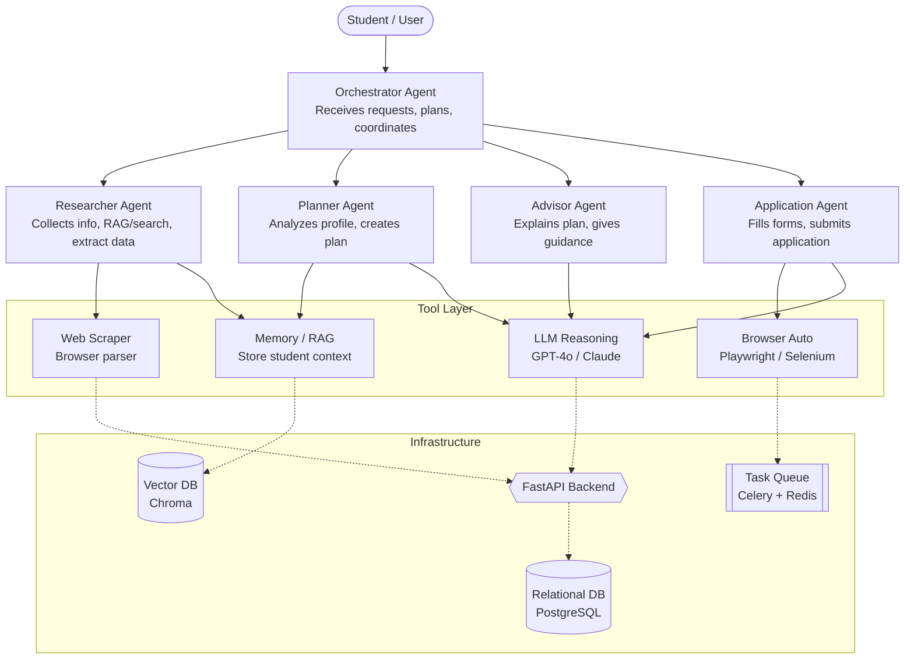
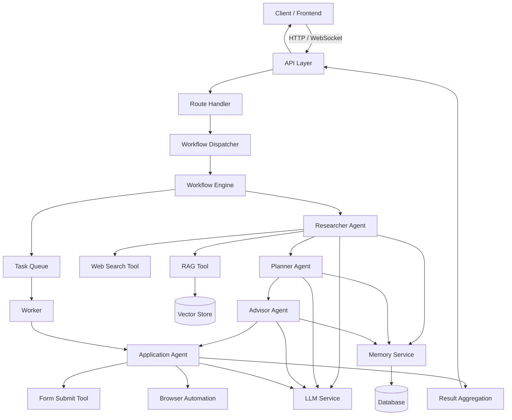
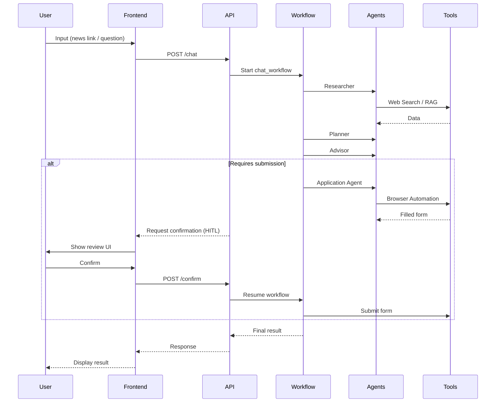

# System Architecture
The architecture relies on a central Orchestrator that delegates tasks to specialized sub-agents. The pipeline is: **Information → Planning → Explanation → Execution**.

## Execution Flow

##  Chat + HITL Flow

